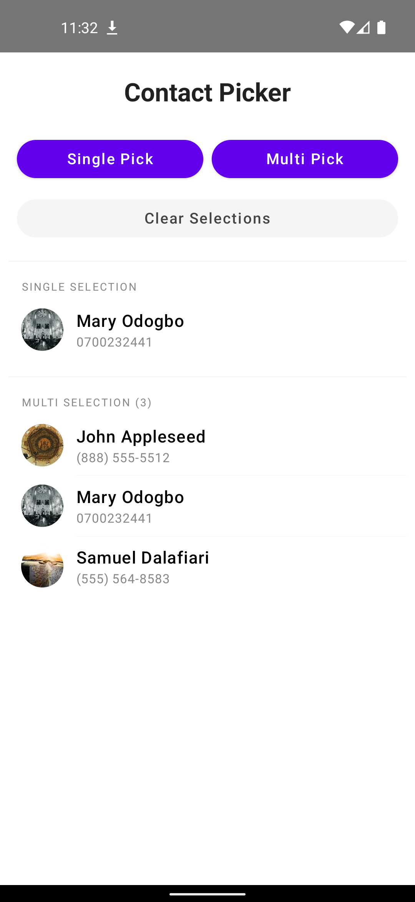
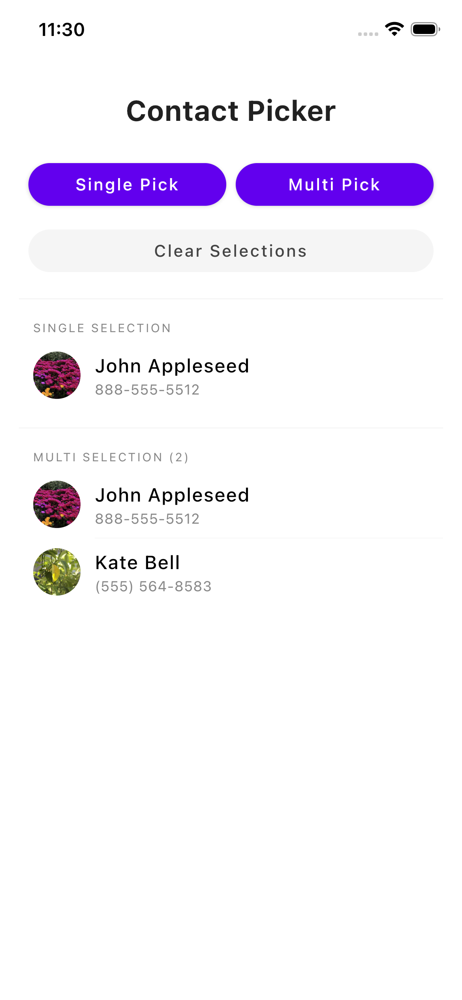
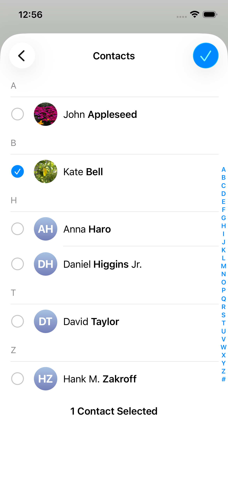

# ContactPicker

[](https://central.sonatype.com/artifact/io.github.dalafiarisamuel/contactpicker)
[](https://github.com/dalafiarisamuel/ContactPickerKMP/actions/workflows/validate-binary.yml)
[](https://opensource.org/licenses/MIT)

**ContactPicker** is a Kotlin Multiplatform (KMP) library that provides a native contact selection experience for Android and iOS using Jetpack Compose Multiplatform.

## Features

- **Native Experience**: Uses `PickContact` contract on Android and `CNContactPickerViewController` on iOS.
- **Compose Multiplatform**: Easy-to-use Composable API with `rememberContactPickerState()` and `rememberMultiContactPickerState()`.
- **Multi-Selection Support**: Select multiple contacts at once with platform-native behavior on iOS and a consistent checkbox-based UI on Android.
- **State Management**: Reactive state handling with built-in `clear()` support to reset selections.
- **Avatar Support**: Retrieve and display contact profile pictures across platforms.
- **Rich Data**: Access names, multiple phone numbers, and email addresses.
- **Type-Safe**: Clean, immutable `Contact` data model.

## Screenshots

| Android | iOS |
| :---: | :---: |
|  |  |
|  |  |

## Documentation

Full API documentation and guides are available at: [https://dalafiarisamuel.github.io/ContactPickerKMP/](https://dalafiarisamuel.github.io/ContactPickerKMP/)

---

## Installation

Add the dependency to your `commonMain` source set in your `build.gradle.kts` file:

```kotlin
kotlin {
    sourceSets {
        commonMain.dependencies {
            implementation("io.github.dalafiarisamuel:contactpicker:0.2.0")
        }
    }
}
```

---

## Usage

### 1. Platform Permissions

Before launching the picker, ensure you have declared the necessary permissions.

#### Android
Add this to your `AndroidManifest.xml`:
```xml
<uses-permission android:name="android.permission.READ_CONTACTS" />
```

#### iOS
Add this to your `Info.plist`:
```xml
<key>NSContactsUsageDescription</key>
<string>Contacts permission is required to access your contacts to help you find friends.</string>
```

### 2. Implementation in Compose

#### Single Selection
```kotlin
import com.devtamuno.kmp.contactpicker.rememberContactPickerState
import com.devtamuno.kmp.contactpicker.extension.toPlatformImageBitmap

@Composable
fun SinglePicker() {
    val contactPicker = rememberContactPickerState()
    val selectedContact by contactPicker.value

    Button(onClick = { contactPicker.launchContactPicker() }) {
        Text("Pick a Contact")
    }
}
```

#### Multiple Selection
```kotlin
import com.devtamuno.kmp.contactpicker.rememberMultiContactPickerState

@Composable
fun MultiPicker() {
    val multiPicker = rememberMultiContactPickerState { contacts ->
        println("Selected ${contacts.size} contacts")
    }
    val selectedContacts by multiPicker.value

    Button(onClick = { multiPicker.launchContactPicker() }) {
        Text("Pick Multiple Contacts")
    }
    
    Text("Count: ${selectedContacts.size}")
}
```

---

## Contributing

Contributions are welcome! If you find a bug or have a feature request, please open an [issue](https://github.com/dalafiarisamuel/ContactPickerKMP/issues) or submit a pull request.

## License

This project is licensed under the MIT License - see the [LICENSE](LICENSE) file for details.
